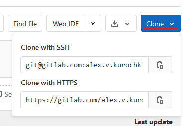
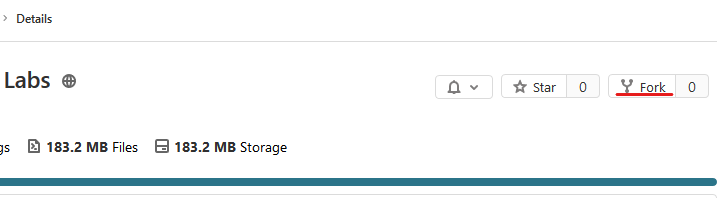
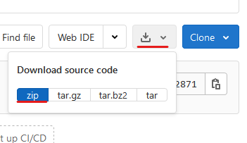

# Лабораторные работы по курсу "Компьютерная стеганография"

## Начало работы

0. Установить [node.js](https://nodejs.org/en/). Все лабораторные работы протестированы на версии `14.7.0`.
1. Получить локальную копию кода этого репозитория с этой страницы одним из указанных способов:

- склонировать этот репозиторий



- сделать fork репозитория и склонировать его



- скачать содержимое репозитория в .ZIP и распаковать



2. Восстановить все зависимости, выполнив в консоли в папке с репозиторием команду `npm install` (необходимо, чтобы `npm` был доступен в `PATH`, по умолчанию добавляется после установки node.js; вручную зависимости перечислять не нужно, они уже указаны в `package.json`).
3. Приступить к выполнению заданий по нужной лабораторной работе в соответствии с `README.md` в соответствующей папке.

В качестве редактора рекомендуется использовать [Visual Studio Code](https://code.visualstudio.com/).

## Реализация заданий лабораторной работы

Каждая лабораторная работа расположена в соответствующей папке `lab1`, `lab2` и т.д. В корневой папке лабораторной работы содержится файл `README.md` с заданием.

Задания к лабораторной работе могут быть двух типов - **практические** и **теоретические**, подробнее каждый тип рассматривается дальше. Кроме того, некоторые задания могут быть помечены как _необязательные_ - выполнение этих заданий не требуется для принятия лабораторной работы, но может повысить оценку.

В папке `lab0` содержится файл с теоретической информацией по синтаксису языка TypeScript в стиле koans, а также пример практического задания и проверяющего его unit-теста. Лабораторная работа `lab0` является необязательной для выполнения и служит в первую очередь как вспомогательная для ознокомления с TypeScript и для демонстрации процесса работы с другими лабораторными работами.

Кроме заданий, в описании лабораторной работы также приводятся контрольные вопросы по соответствующей теме. По ним происходит выборочный опрос при сдаче. Материалы для ответов на контрольные вопросы приводятся в лекциях или могут быть найдены в открытых источниках.

## Практические задания

Практические задания лабораторной работы реализуются непосредственно написанием кода. В списке заданий возле них располагается надпись `(практическое)`. Например:

> ### Задание 2 `(практическое)`
>
> Реализовать в теле функции `helloWorld` файла `lab0.ts` вывод сообщения с текстом "Hello, world!" на консоль при помощи функции `console.log`.

В пояснении к практическому заданию указано, в каком файле должна быть предоставлена реализация (в данном случае `lab0.ts`); кроме того, в самом исходоном коде этого файла место, где должно быть реализовано то или иное задание, обычно будет помечено комментарием вида `// TODO: Код к заданию Х здесь`. Например, часть исходного кода файла `lab0.ts` выглядит следующим образом:

```ts
export function helloWorld() {
  // TODO: Код к заданию 2 здесь
}
```

К каждой лабораторной работе дополнительно прилагается набор unit-тестов для самопроверки. Для запуска unit-тестов можно использовать команду `npx jest <папка с лабораторной>`. Например, для запуска unit-тестов по `lab0` команда имеет следующий вид:

```bash
> npx jest lab0
```

Помимо непосредственно запуска unit-тестов, можно также производить их отладку. Для отладки рекомендуется использовать встроенный отладчик Visual Studio Code. В репозитории уже созданы соответствующие конфигурации для запуска тестов, поэтому можно поставить точку останова в интересующем месте и запустить стандартную конфигурацию (по умолчанию F5). Стандартная конфигурация запускает весь набор unit-тестов к папке текущего открытого файла (например, если открыт файл `lab0.ts`, по F5 начнётся отладка всех тестов в папке `lab0`).

Обратите внимание, что выполнение лабораторных работ не подразумевает модификацию самих unit-тестов, проверяющих ваш код 😉

## Теоретические задания

Теоретические задания подразумевают устный ответ преподавателю на момент сдачи лабораторной работы. В списке заданий возле них располагается надпись `(теоретическое)`. Например:

> ### Задание 3 `(теоретическое)`
>
> Пояснить результат, полученный в задании 2. Предложить другие варианты вывода значений на консоль.

Теоретические задания не подразумевают написания кода, вне зависимости от формулировки. Например, в этом задании "предложить другие варианты" трактуется как "устно предложить другие варианты преподавателю непосредственно при сдаче". При желании, для удобства демонстрации какой-либо исходный код можно реализовывать в отдельном файле.

## Критерии сдачи лабораторных работ

Для _практических_ заданий:

- после комментариев `// TODO: Код к заданию Х здесь` написан собственный код
- исходный код продемонстрирован преподавателю и пояснён в соответствии с любыми возникающими вопросами
- для всего набора практических заданий лабораторной работы успешно проходят все unit-тесты (в которые не внесено изменений)
- результаты успешного прохождения unit-тестов продемонстрированы преподавателю **непосредственным запуском тестов во время сдачи**

Для _теоретических_ заданий:

- преподавателю предоставлен удовлетворительный устный ответ на задание

Лабораторная работа может быть оценена и считаться сданной тогда и только тогда, когда выполнены все её задания, кроме _необязательных_. Например, если в лабораторной 6 обязательных заданий, выполнение 3 из 6 не означает, что получена оценка "5" - до тех пор, пока не выполнены все 6, **оценка не ставится вообще**.

Оценка за лабораторную работу ставится не за выборочное выполнение заданий, а за качество предоставленной реализации, пояснений и устных ответов на контрольные вопросы - выполнив все 6 заданий и не ответив преподавателю ни на один дополнительный вопрос может быть получена оценка 4. Преподаватель оставляет за собой право не засчитать выполнение какого-либо задания, если имеются основания полагать, что задание не было выполнено студентом самостоятельно.

## FAQ

- У меня ничего не устанавливается и ничего не работает. Что делать?

Попросите преподавателя помочь с настройкой, или опишите свою проблему с предоставлением всех логов в Telegram-группе курса.

- Как запустить свой код?

В `node.js` запуск какого-либо кода осуществляется запуском всего файла как сценария, при этом начинает выполняться код верхнего уровня в этом файле (т.е. функция `main` или её аналог не требуется). С другой стороны, в лабораторных работах в первую очередь рассматриваются различные алгоритмы, которые удобнее представлять не сценариями, а функциями `(входные значения) => (выходное значение)`. Поэтому для проверки этих функций проще всего пользоваться предложенными unit-тестами. Можно ознакомиться с кодом unit-тестов или добавить свои - для этого нужно создать файл, имя которого заканчивается на `.test.ts`, и в нём выполнить вызов соответствующих функций с интересующими вас параметрами.

- А что будет тем, кто поменяет код в unit-тестах?

Не будут засчитаны задания, +1 балл за креативность также не будет предоставлен, потому что этот сценарий предусмотрен и описан здесь 😛

- Я не знаю, как ответить на какой-то контрольный вопрос, что делать?

Попросите кого-нибудь из коллег поделиться конспектом лекций, задайте вопрос в Telegram-группе курса, попытайтесь поискать ответ самостоятельно в интернете.
